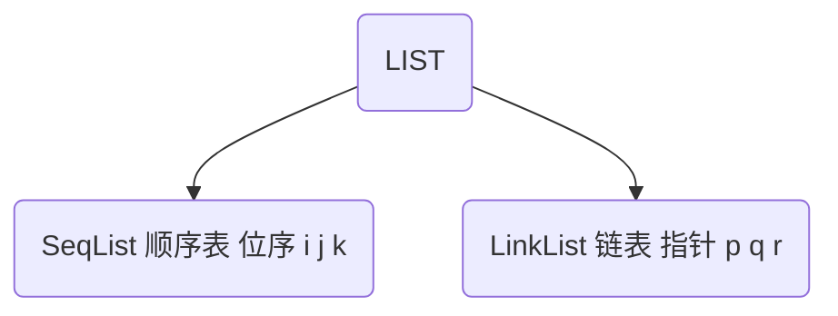

# 线性表



- 表的基本操作
  - 查值 ListLocate(L,pos)
  - 插入 ListInsert(L)
  - 删除 ListDelete(L,pos)

- 除此之外还有
  - 查地址  ListSearch(L,Value)
  - 初始化  ListInit(L)
  - 销毁      DestoryList(L)
  - 置空      ListClear(L)
  - 遍历      ListTraverse(L)
  - 求前驱  PriorElem(L,cur,&pre)
  - 求后驱  NextElem(L,cur,&next)

## SeqList顺序表

### 查找

```C++
#define MAXSIZE 100
typedef int ElemType;
typedef struct SeqList
{
	ElemType elem[MAXSIZE];
    int last;
}SeqList;
int ListLocate(SeqList L,ElemType e){
}
```

### LinkList链表

代码

```C
#include<stdio.h>
#include<stdlib.h>

typedef struct ListNode{
        int val;
        struct ListNode *next;
}ListNode;
//初始化节点
ListNode * ListInit(int x){
        ListNode *node =(ListNode *)malloc(sizeof(ListNode));
        node->val=x;
        node->next=NULL;
        return node;
}
//在头节点后插入值
void ListAddAtHead(ListNode *head,int val){
        //初始化节点
        ListNode *newNode=ListInit(val);

        if(head->next==NULL){
                //头节点为空时，直接插到头节点后
                head->next=newNode;
                return;
        }
        else{
                //不为空时，进行变换
                newNode->next=head->next;
                head->next=newNode;
        }
}
//在链表尾部添加值
void ListAddAtTail(ListNode *head,int val){
        ListNode *newNode =ListInit(val);
        //设置哨兵指针
        ListNode *p=head;
        //遍历到尾节点
        while(p->next!=NULL){
                p=p->next;
        }
        //在尾部节点添加新节点
        p->next=newNode;
}
//链表遍历
void ListTraverse(ListNode *head){
        ListNode *p=head;
        while(p->next!=NULL){
                p=p->next;
                printf("%d  ",p->val);
        }
        printf("\n");
}
//就地逆置
void ListReverse(ListNode *head){
        if(head==NULL||head->next==NULL){}
        else{
                ListNode * pre,*p;
                pre =head->next;
                head->next=NULL;
                while(pre){
                        p=pre;
                        pre=pre->next;
                        p->next=head->next;
                        head->next=p;
                }
        }
}

int main(){
        ListNode *head=ListInit(0);
        //printf("This is head node %d\n",head1->val);
        int sum_node;

        printf("please input sum of listnode:\t");
        scanf("%d",&sum_node);
        printf("please input node:\t");
        for(sum_node;sum_node>0;sum_node--){
                int temp;
                scanf("%d",&temp);
                ListAddAtTail(head,temp);
        }
        ListTraverse(head);
        ListReverse(head);
        ListTraverse(head);
        return 0;
}
```


## 栈和队列

- 栈Stack
  - 基本操作puch(),pop()   只能这两个操作
  - 后进先出(Last in first out LIFO)
- 队列
  - 先进先出(FIFO)

-  相同点
  - 逻辑结构都为线性结构
  - 存储结构同样是有顺序和链式两种

**带尾指针的单循环链表** 就是天然的**队列**

**带头节点的单链表** 且只在头节点后插入删除，就是**栈**

### 双头栈

这是栈在系统内存真实的存在。这个方式的系统资源利用率很高。


当该栈为满栈时，就可以构成队列，一端进，一端出。

应用：
		在变量保护中，常用到栈。

```C
int main(){
	int x=3;
    int y=5;
    add(x,y);
}
//在调用add(x,y)时，系统先把x,y puch进栈然后在用调用，调用完后，又pop出y,x
//这样就保证了上下文。
void add(a,b){
...
    a=7;
    b=9;
}
```

> Q&A   
>
> A ,B,C 入栈有几种出栈顺序？      ===》5种
>
> > ABC     Apuch Apop Bpuch Bpop Cpuch Cpop
> >
> > ACB     Apuch Apop Bpuch Cpuch Cpop Bpop
> >
> > BAC     Apuch Bpuch Bpop Apop Cpuch Cpop
> >
> > BCA     Apuch Bpuch Bpop Cpuch Cpop Apop
> >
> > CBA     Apuch Bpuch Cpuch Cpop Bpop Apop
>
> 4个元素入栈？      ==》14种
>
> > abcd  abdc  acbd  acdb
> > adcb  bacd  badc  bcad
> > bcda  bdca  cbad  cbda
> > cdba  dcba
>
> n个元素？             ===》卡特兰数
>
> >令$h(0)=1,h(1)=1$，卡特兰数满足递推式：
> >
> >$h(n)= h(0)*h(n-1)+h(1)*h(n-2) + ... + h(n-1)h(0) (n>=2)$
> >
> >例如：
> >
> >$h(2)=h(0)*h(1)+h(1)*h(0)=1*1+1*1=2$$h(3)=h(0)*h(2)+h(1)*h(1)+h(2)*h(0)=1*2+1*1+2*1=5$；
> >
> >另类递推式：$h(n)=h(n-1)*(4*n-2)/(n+1)$；
> >
> >递推关系的解为：$h(n)=C(2n,n)/(n+1) (n=1,2,3,...)$；
> >
> >递推关系的另类解为：$h(n)=C(2n,n)-C(2n,n+1)(n=1,2,3,...)$；

### 队列


假溢出

<table>
    <tr>
        <td>
            
        <td>
        
</table>


但rear超出到数组的末尾后，就会出现假溢出

解决方法-----循环顺序队列

```C
front=(front+1)%MAXQUEUE;//%为取余
rear=(rear+1)%MAXQUEUE;
```

但是有会引发新的问题：

由于初始状态是`front=-1;rear=-1`,及两个指针相同时为空

但是现在

队列的判空判满问题？

**方式1(牺牲一存储单元)： 牺牲一个单元来区分队空和队满，入队时少用一个队列单元，即约定以"队头指针在队尾指针的下一位置作为队满的标志"。**

```
队满条件为：(rear+1)%QueueSize==front
队空条件为：front==rear
队列长度为：(rear-front++QueueSize)%QueueSize
```

**方式2(采用计数器)： 增设表示队列元素个数的数据成员size，此时，队空和队满时都有front==rear。**

```
队满条件为：size==QueueSize
队空条件为：size==0
```

**方式3(设置标志位)： 增设tag数据成员以区分队满还是队空**

```
tag表示0的情况下，若因删除导致front==rear，则队空；
tag等于1的情况，若因插入导致front==rear则队满
```

比较：这三个中，推荐牺牲一个存储单位来实现判空判满，因为它用了一个协议就解决了问题，而其他的都会增加变量，这样不尽增加了空间消耗，还让多了变量(变量还需要维护，这个成本比较大)


## 链表


作为线性表的两种存储方式 —— 链表和数组，这对相爱相杀的好基友有着各自的优缺点。接下来，我们梳理一下这两种方式。

**数组**，所有元素都连续的存储于一段内存中，且每个元素占用的内存大小相同。这使得数组具备了通过下标快速访问数据的能力。  

但连续存储的缺点也很明显，增加容量，增删元素的成本很高，时间复杂度均为 O(n)。  

增加数组容量需要先申请一块新的内存，然后复制原有的元素。如果需要的话，可能还要删除原先的内存。  

  

删除元素时需要移动被删除元素之后的所有元素以保证所有元素是连续的。增加元素时需要移动指定位置及之后的所有元素，然后将新增元素插入到指定位置，如果容量不足的话还需要先进行扩容操作。

  

总结一下数组的优缺点：

* 优点：可以根据偏移实现快速的随机读写。
* 缺点：扩容，增删元素极慢。

链表，由若干个结点组成，每个结点包含数据域和指针域。结点结构如下图所示：  

  

一般来讲，链表中只会有一个结点的指针域为空，该结点为**尾结点**，其他结点的指针域都会存储一个结点的内存地址。链表中也只会有一个结点的内存地址没有存储在其他结点的指针域，该结点称为**头结点**。  

  

链表的存储方式使得它可以高效的在指定位置插入与删除，时间复杂度均为 O(1)。  

在结点 p 之后增加一个结点 q 总共分三步：

1.  申请一段内存用以存储 q (可以使用内存池避免频繁申请和销毁内存)。
2.  将 p 的指针域数据复制到 q 的指针域。
3.  更新 p 的指针域为 q 的地址。  
4.  

删除结点 p 之后的结点 q 总共分两步：

1. 将 q 的指针域复制到 p 的指针域。

2.  释放 q 结点的内存。  
    
    

### 链表的主要代码

```C
#include <bits/stdc++.h>

using namespace std;

//定义一个结点模板
template<typename T>
struct Node {
	T data;
	Node *next;
	Node() : next(nullptr) {}
	Node(const T &d) : data(d), next(nullptr) {}
};

//删除 p 结点后面的元素
template<typename T>
void Remove(Node<T> *p) {
	if (p == nullptr || p->next == nullptr) {
		return;
	}
	auto tmp = p->next->next;
	delete p->next;
	p->next = tmp;
}

//在 p 结点后面插入元素
template<typename T>
void Insert(Node<T> *p, const T &data) {
	auto tmp = new Node<T>(data);
	tmp->next = p->next;
	p->next = tmp;
}

//遍历链表
template<typename T, typename V>
void Walk(Node<T> *p, const V &vistor) {
	while(p != nullptr) {
		vistor(p);
		p = p->next;
	}
}

int main() {
	auto p = new Node<int>(1);
	Insert(p, 2);
	int sum = 0;
	Walk(p, [&sum](const Node<int> *p) -> void { sum += p->data; });
	cout << sum << endl;
	Remove(p);
	sum = 0;
	Walk(p, [&sum](const Node<int> *p) -> void { sum += p->data; });
	cout << sum << endl;
	return 0;
}
```

### 面试问题总结

#### 快慢指针

无法高效获取长度，无法根据偏移快速访问元素，是链表的两个劣势。然而面试的时候经常碰见诸如**获取倒数第k个元素**，**获取中间位置的元素**，**判断链表是否存在环**，**判断环的长度**等和长度与位置有关的问题。这些问题都可以通过灵活运用双指针来解决。

**Tips：双指针并不是固定的公式，而是一种思维方式~**

先来看"倒数第k个元素的问题"。设有两个指针 p 和 q，初始时均指向头结点。首先，先让 p 沿着 next 移动 k 次。此时，p 指向第 k+1个结点，q 指向头节点，两个指针的距离为 k 。然后，同时移动 p 和 q，直到 p 指向空，此时 p 即指向倒数第 k 个结点。可以参考下图来理解：  


```c++
class Solution {
public:
    ListNode* getKthFromEnd(ListNode* head, int k) {
        ListNode *p = head, *q = head; //初始化
        while(k--) {   //将 p指针移动 k 次
            p = p->next;
        }
        while(p != nullptr) {//同时移动，直到 p == nullptr
            p = p->next;
            q = q->next;
        }
        return q;
    }
};
```

获取中间元素的问题。设有两个指针 fast 和 slow，初始时指向头节点。每次移动时，fast向后走两次，slow向后走一次，直到 fast 无法向后走两次。这使得在每轮移动之后。fast 和 slow 的**距离就会增加一**。设链表有 n 个元素，那么最多移动 n/2 轮。当 n 为**奇数**时，slow 恰好**指向中间结点**，当 n 为 **偶数**时，slow 恰好**指向中间两个结点的靠前一个**(可以考虑下如何使其指向后一个结点呢？)。  

  
下述代码实现了 n 为**偶数**时慢指针指向**靠后结点**。


```c++
class Solution {
 public:
    ListNode* middleNode(ListNode* head) {
        ListNode *p = head, *q = head;
        while(q != nullptr && q->next != nullptr) {
            p = p->next;
            q = q->next->next;
        }
        return p;
    } 
};
```

是否存在环的问题。如果将尾结点的 next 指针指向其他任意一个结点，那么链表就存在了一个环。  

  

上一部分中，总结快慢指针的特性 —— 每轮移动之后两者的距离会加一。下面会继续用该特性解决环的问题。  

当一个链表有环时，快慢指针都会陷入环中进行无限次移动，然后变成了追及问题。想象一下在操场跑步的场景，只要一直跑下去，快的总会追上慢的。当两个指针都进入环后，每轮移动使得慢指针到快指针的距离增加一，同时快指针到慢指针的距离也减少一，只要一直移动下去，快指针总会追上慢指针。  

  
根据上述表述得出，如果一个链表存在环，那么快慢指针必然会相遇。实现代码如下：

```C++
class Solution {
public:
    bool hasCycle(ListNode *head) {
        ListNode *slow = head;
        ListNode *fast = head;
        while(fast != nullptr) {
            fast = fast->next;
            if(fast != nullptr) {
                fast = fast->next;
            }
            if(fast == slow) {
                return true;
            }
            slow = slow->next;
        }
        return nullptr;
    }
};
```

最后一个问题，如果存在环，如何判断环的长度呢？方法是，快慢指针相遇后继续移动，直到第二次相遇。两次相遇间的移动次数即为环的长度。


