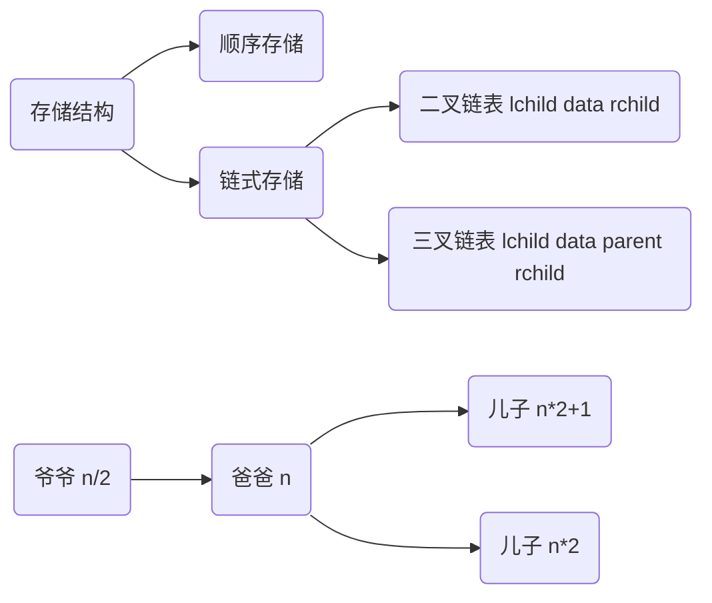
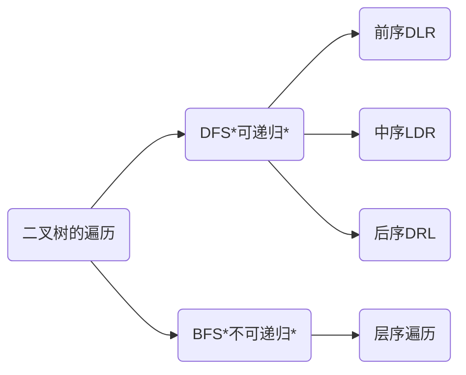
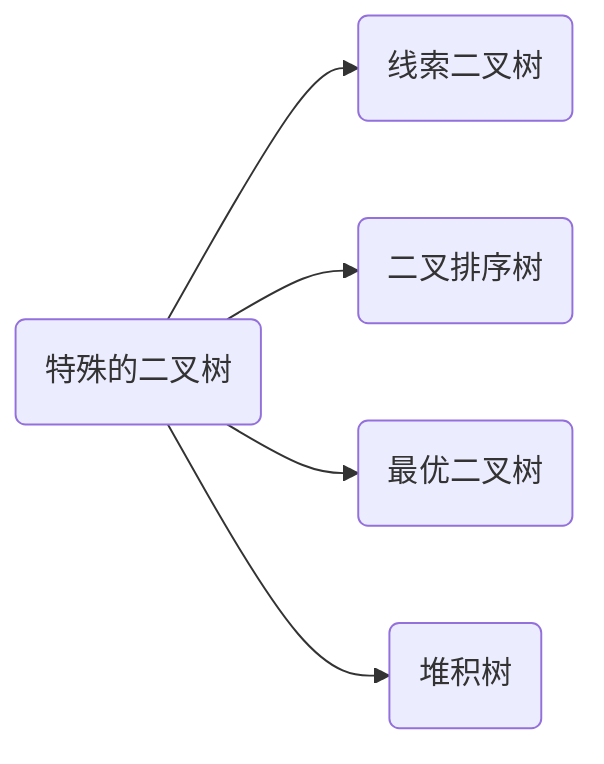

## 4.TREE

树型结构是一类重要的数据结构。

**KEY WORDS**

节点的度degree为子树的数量、

度为0的为叶子Leaf

同双亲的孩子之间互称兄弟Sibling

同层不同双亲的互称堂兄弟

层次Level从根开始定义，根为第一层。最大层次为树的深度。

森林去掉根节点所剩下的子树构成森林。


### 4.1.二叉树

二叉树是$n(n≥0)$个有序节点构成的集合。$n=0$成为空二叉树；$n>0$的二叉树有一个根节点和两个互不相交的，分别称为左子树和右子树的二叉树构成。

>   有上面的定义我们可以知道二叉树和递归的关系不浅。后面实现遍历、求叶子数、求节点数都会用到递归的方法。

#### 4.1.1.二叉树的存储结构



**链式存储**:
	每个节点有m+1个域，其中m个指针域指向孩子，则空指针的数目为 $n×m-(n-1)=n×(m-1)+1$个。
	所以==如果m越大，存储效率越低。==

```C
typedef struct BiNode{
    int val;
    strcut BiNode * lchild;
    strcut BiNode * lchild;  
}BiNode;
```


**顺序存储**：
	n的双亲节点是n/2(在C语言中,即取整)，儿子节点是 $n*2+1\ \ \& \ \ n*2  $
	节点$i,j$处于同一层的条件是 $ ⌊log_2i⌋ =⌊log_2j ⌋$

#### 4.1.2.二叉树的性质

对于二叉树，包含一些性质：

-   在二叉树中，第 $i$层上至多有$2^{i−1}$个节点（$i≥1$）
-   深度为$k$的二叉树至多有$2^k−1$个节点（$k≥1$）
-   对一棵二叉树，如果叶子节点的个数为$n_0$，度为$2$的节点个数为$n_2$，则$n_0=n_2+1$
-   具有$n$个节点的完全二叉树的深度为$⌊log_2n⌋+1$

#### 4.1.3.常见的二叉树

在一棵二叉树中，如果所有分支结点都存在左子树和右子树，并且叶子结点都在同一层上，这样的二叉树称作**满二叉树**。一棵深度为$k$且由$2^k-1$个结点的二叉树称为满二叉树。

如果一棵具有n个结点的二叉树的结构与满二叉树的前n个结点的结构相同，这样的二叉树称作**完全二叉树**。


#### 4.1.4.二叉树的遍历



|    树    |  图  | 非递归 |
| :------: | :--: | :----: |
| 先中后序 | DFS  |   栈   |
|   层序   | BFS  |  队列  |


##### DFS

**递归方法**

```C
// 前序遍历
void Traverse_PreOrder(BiNode* root) {
	if (root != NULL) {
		printf("%d ", root->val);
		Traverse_PreOrder(root->lchild);
		Traverse_PreOrder(root->rchild);
	}
}
// 中序遍历
void Traverse_InOrder(BiNode* root) {
	if (root != NULL) {
		Traverse_InOrder(root->lchild);
		printf("%d ", root->val);
		Traverse_InOrder(root->rchild);
	}
}
// 后序遍历
void Traverse_PostOrder(BiNode* root) {
	if (root != NULL) {
		Traverse_PostOrder(root->lchild);
		Traverse_PostOrder(root->rchild);
		printf("%d ", root->val);
	}
}
```

**非递归法**

```C++
//非递归前序遍历 
/*
对于任一结点P：
     1)访问结点P，并将结点P入栈;
     2)判断结点P的左孩子是否为空，若为空，则取栈顶结点并进行出栈操作，并将栈顶结点的右孩子置为当前的结点P，循环至1);若不为空，则将P的左孩子置为当前的结点P;
     3)直到P为NULL并且栈为空，则遍历结束。
*/
void Traverse_PreOrder1(BiTree *root)     
{
    stack<BinTree*> s;
    BiTree *p=root;
    while(p!=NULL||!s.empty())//出口
    {
        while(p!=NULL)//访问p节点，并入栈
        {
            cout<<p->data<<"";
            s.push(p);  
            p=p->lchild;
        }
        if(!s.empty())
        {
            p=s.top();
            s.pop();
            p=p->rchild;
        }
    }
}
/*
非递归中序遍历
对于任一结点P，
  1)若其左孩子不为空，则将P入栈并将P的左孩子置为当前的P，然后对当前结点P再进行相同的处理；
  2)若其左孩子为空，则取栈顶元素并进行出栈操作，访问该栈顶结点，然后将当前的P置为栈顶结点的右孩子；
  3)直到P为NULL并且栈为空则遍历结束
*/
void Traverse_InOrder1(BiTree *root)      
{
    stack<BinTree*> s;
    BiTree *p=root;
    while(p!=NULL||!s.empty())
    {
        while(p!=NULL)
        {
            s.push(p);
            p=p->lchild;
        }
        if(!s.empty())
        {
            p=s.top();
            cout<<p->data<<"";
            s.pop();
            p=p->rchild;
        }
    }    
} 

```

​	后序遍历的非递归实现是三种遍历方式中最难的一种。因为在后序遍历中，要保证左孩子和右孩子都已被访问并且左孩子在右孩子前访问才能访问根结点，这就为流程的控制带来了难题。下面介绍两种思路。

   第一种思路：对于任一结点P，将其入栈，然后沿其左子树一直往下搜索，直到搜索到没有左孩子的结点，此时该结点出现在栈顶，但是此时不能将其出栈并访问，因此其右孩子还为被访问。所以接下来按照相同的规则对其右子树进行相同的处理，当访问完其右孩子时，该结点又出现在栈顶，此时可以将其出栈并访问。这样就保证了正确的访问顺序。可以看出，在这个过程中，每个结点都两次出现在栈顶，只有在第二次出现在栈顶时，才能访问它。因此需要多设置一个变量标识该结点是否是第一次出现在栈顶。

```C++
typedef struct BTNode{
    BiTree *btnode;
    bool isFirst;
}BTNode;

void postOrder2(BiTree *root)    //非递归后序遍历
{
    stack<BTNode*> s;
    BiTree *p=root;
    BTNode *temp;
    while(p!=NULL||!s.empty())
    {
        while(p!=NULL)              //沿左子树一直往下搜索，直至出现没有左子树的结点 
        {
            BTNode *btn=(BTNode *)malloc(sizeof(BTNode));
            btn->btnode=p;
            btn->isFirst=true;
            s.push(btn);
            p=p->lchild;
        }
        if(!s.empty())
        {
            temp=s.top();
            s.pop();
            if(temp->isFirst==true)     //表示是第一次出现在栈顶 
             {
                temp->isFirst=false;
                s.push(temp);
                p=temp->btnode->rchild;    
            }
            else//第二次出现在栈顶 
             {
                cout<<temp->btnode->data<<"";
                p=NULL;
            }
        }
    }    
} 
```

​     第二种思路：要保证根结点在左孩子和右孩子访问之后才能访问，因此对于任一结点P，先将其入栈。如果P不存在左孩子和右孩子，则可以直接访问它；或者P存在左孩子或者右孩子，但是其左孩子和右孩子都已被访问过了，则同样可以直接访问该结点。若非上述两种情况，则将P的右孩子和左孩子依次入栈，这样就保证了每次取栈顶元素的时候，左孩子在右孩子前面被访问，左孩子和右孩子都在根结点前面被访问。

```C++
void postOrder3(BinTree *root)     //非递归后序遍历
{
    stack<BinTree*> s;
    BinTree *cur;                      //当前结点 
    BinTree *pre=NULL;                 //前一次访问的结点 
    s.push(root);
    while(!s.empty())
    {
        cur=s.top();
        if((cur->lchild==NULL&&cur->rchild==NULL)||
           (pre!=NULL&&(pre==cur->lchild||pre==cur->rchild)))
        {
            cout<<cur->data<<"";  //如果当前结点没有孩子结点或者孩子节点都已被访问过 
              s.pop();
            pre=cur; 
        }
        else
        {
            if(cur->rchild!=NULL)
                s.push(cur->rchild);
            if(cur->lchild!=NULL)    
                s.push(cur->lchild);
        }
    }    
}
```


>   参考资料:https://www.cnblogs.com/dolphin0520/archive/2011/08/25/2153720.html

##### BFS

```C
// C中没有queue这个函数，只能自己造轮子
//入队函数
void EnQueue(BiNode **a,BiNode *node){
    a[rear++]=node;
}
//出队函数
BiNode* DeQueue(BiNode** a){
    return a[front++];
}
//层序遍历
void Traverse_LeverOrder(BiNode * root){
	BiNode * p;
    //采用顺序队列，初始化创建队列数组
    BiNode * a[20];
    //根结点入队
    EnQueue(a, root);
    //当队头和队尾相等时，表示队列为空
    while(front < rear) {
        //队头结点出队
        p=DeQueue(a);
        printf("%d ", p->val);
        //将队头结点的左右孩子依次入队
        if (p->lchild!=NULL) {
            EnQueue(a, p->lchild);
        }
        if (p->rchild!=NULL) {
            EnQueue(a, p->rchild);
        }
    }

}
```


图源:[树：二叉树的层序遍历算法（超简洁实现及详细分析）](https://blog.csdn.net/qq_29542611/article/details/79372678)

```C++
#include <queue>
void levelTravel(TiNode *root){
    if(root == NULL)
        return;
    queue<TiNode*>  Q;
    Q.push(root);      //初始化

    while(!Q.empty()){
        TiNode* cur = Q.front();
        Q.pop();
        visit(cur);
        if(cur->left)   Q.push(cur->left);//一般从左到右
        if(cur->right)  Q.push(cur->right);
    }
}
```

### 4.2.特殊的二叉树



#### 4.2.1.线索二叉树 Threaded Binary Tree

Inorder traversal of a Binary tree can either be done using recursion or with the use of a auxiliary stack. The idea of threaded binary trees is to make inorder traversal faster and do it without stack and without recursion. A binary tree is made threaded by making all right child pointers that would normally be NULL point to the inorder successor of the node (if it exists).      ---->https://www.geeksforgeeks.org/threaded-binary-tree/

如下图，我们可以看见一共有6个节点，一共12个指针域，有7个Null指针域。这样的指针域的利用效率非常低(==n个节点:$2n-(n-1)=n+1$个Null指针域==)。


所以**为了提高指针域的利用率**，A.J.perils & C.Thornton 就提出了线索二叉树的概念。

实际上也就是当二叉树的左右孩子结点为Null 的时候，指向的地址是浪费的,为了减少浪费我们可以通过将其指向前驱或者后续来利用这些无用的空间，提升查找速度，值得注意的是实际使用中我们要根据选择的二叉树遍历规则来进行对应的指向(前序、中序、后序)要保持一直。一般来说我们使用中序遍历进行二叉树线索化。

下面用中序遍历来举例:

上面的例子的线索化如下


##### 线索二叉树的结构

为了辨识出这个指针域是线索的用途还是指向孩子节点，我们在二叉树的结构上增加了左右标志位，如果为0，是指向孩子节点，为1为线索的用途。

>   For fully threaded binary tree, each node has five fields. Three fields like normal binary tree node, another two fields to store Boolean value to denote whether link of that side is actual link or thread.

```C
struct Node  
{ 
    int data; 
    struct Node *lchild
    struct Node *rchild; 
    bool ltag; 
    bool rtag;   
} 
```

```C
| Left Thread Flag | Left Link | Data | Right Link | Right Thread Flag |
```


##### 遍历过程


图源:https://www.geeksforgeeks.org/threaded-binary-tree/

```C
// Insertion in Threaded Binary Search Tree. 
#include<bits/stdc++.h> 
using namespace std; 
  
struct Node 
{ 
    struct Node *left, *right; 
    int info; 
  
    // True if left pointer points to predecessor 
    // in Inorder Traversal 
    bool lthread; 
  
    // True if right pointer points to predecessor 
    // in Inorder Traversal 
    bool rthread; 
}; 
  
// Insert a Node in Binary Threaded Tree 
struct Node *insert(struct Node *root, int ikey) 
{ 
    // Searching for a Node with given value 
    Node *ptr = root; 
    Node *par = NULL; // Parent of key to be inserted 
    while (ptr != NULL) 
    { 
        // If key already exists, return 
        if (ikey == (ptr->info)) 
        { 
            printf("Duplicate Key !\n"); 
            return root; 
        } 
  
        par = ptr; // Update parent pointer 
  
        // Moving on left subtree. 
        if (ikey < ptr->info) 
        { 
            if (ptr -> lthread == false) 
                ptr = ptr -> left; 
            else
                break; 
        } 
  
        // Moving on right subtree. 
        else
        { 
            if (ptr->rthread == false) 
                ptr = ptr -> right; 
            else
                break; 
        } 
    } 
  
    // Create a new node 
    Node *tmp = new Node; 
    tmp -> info = ikey; 
    tmp -> lthread = true; 
    tmp -> rthread = true; 
  
    if (par == NULL) 
    { 
        root = tmp; 
        tmp -> left = NULL; 
        tmp -> right = NULL; 
    } 
    else if (ikey < (par -> info)) 
    { 
        tmp -> left = par -> left; 
        tmp -> right = par; 
        par -> lthread = false; 
        par -> left = tmp; 
    } 
    else
    { 
        tmp -> left = par; 
        tmp -> right = par -> right; 
        par -> rthread = false; 
        par -> right = tmp; 
    } 
  
    return root; 
} 
  
// Returns inorder successor using rthread 
struct Node *inorderSuccessor(struct Node *ptr) 
{ 
    // If rthread is set, we can quickly find 
    if (ptr -> rthread == true) 
        return ptr->right; 
  
    // Else return leftmost child of right subtree 
    ptr = ptr -> right; 
    while (ptr -> lthread == false) 
        ptr = ptr -> left; 
    return ptr; 
} 
  
// Printing the threaded tree 
void inorder(struct Node *root) 
{ 
    if (root == NULL) 
        printf("Tree is empty"); 
  
    // Reach leftmost node 
    struct Node *ptr = root; 
    while (ptr -> lthread == false) 
        ptr = ptr -> left; 
  
    // One by one print successors 
    while (ptr != NULL) 
    { 
        printf("%d ",ptr -> info); 
        ptr = inorderSuccessor(ptr); 
    } 
} 
  
// Driver Program 
int main() 
{ 
    struct Node *root = NULL; 
  
    root = insert(root, 20); 
    root = insert(root, 10); 
    root = insert(root, 30); 
    root = insert(root, 5); 
    root = insert(root, 16); 
    root = insert(root, 14); 
    root = insert(root, 17); 
    root = insert(root, 13); 
  
    inorder(root); 
  
    return 0; 
}
```


此外，线索二叉树还可以只有前驱线索或者后驱线索如下：

<table>
    <tr>
        <td>
            
        </td>
        <td>
            
        </td>
         <td>
            
        </td>
    </tr>
</table>

依次是左线索、右线索、线索二叉树。

#### 4.2.2.二叉排序树 BST

二叉排序树，又称为二叉查找树Binary Search Tree。二叉排序树或者是一棵空树，或者是具有以下性质的二叉树：若其左子树不为空，则左子树上的所有节点的值均小于它的根结点的值；若其右子树不为空，则右子树上的所有节点的值均大于它的根结点的值；左右子树又分别是二叉排序树。（==中序递增==）

##### 删除操作

-   删除叶子节点，直接删除。
-   删除度为1的节点，以其非空子节点代替。
-   删除度为2的节点，以其前驱节点代替。
    -   度为2的前驱(中序遍历) 度可能为0或1，回到前面两个操作。

```C++
       //删除操作 
        BiNode* Delete(BiNode* BST,int data){
            if(!BST){//树空时，直接返回NULL 
                return BST;
            }else if(data < BST->data){
                //data小于根节点时，到左子树去删除data 
                BST->lchild = Delete(BST->lchild,data);
            }else if(data > BST->data){
                //data大于根节点时，到右子树去删除data 
                BST->rchild = Delete(BST->rchild,data); 
            }else{//data等于根节点时,执行删除操作
                if(BST->lchild && BST->rchild){
                    //删除度为2的节点，以其前驱节点代替。
                    //左右子树都不空时，用右子树的最小来代替根节点
                    BinarySearchTree* tmp = FindMin(BST->rchild);
                    BST->data = tmp->data;
                    //删除右子树的最小结点 
                    BST->rchild = Delete(BST->rchild,tmp->data);
                }else{//当左右子树都为空或者有一个空时 
                    BiNode* tmp = BST;
                    if(!BST->lchild){//左子树为空时 
                        BST = BST->rchild;
                    }else if(!BST->rchild){//右子树为空时 
                        BST = BST->lchild; 
                    }
                    delete tmp; 
                }
            }
            return BST;
        }
```

##### 查找性能

>   回顾：
>
>   -   顺序表：
>       -   查找
>           -   查命中失败: $n$
>           -   查命中成功: $\frac{n+1}2=\sum_{i=1}^n p_i*i=\frac1n(1+2+3+...+n)=\frac1n \frac{n(n+1)}2$
>       -   插入
>           -   $\frac n2=\sum_{i=1}^np_i*(n-i+1)=\frac1{n+1}\frac{n(n+1)}2$
>       -   删除
>           -   $\frac{n-1}2=\sum_{i=1}^np_i(n-i)=\frac1n\frac{(n-1)n}2$

平均查找长度(Average Search Length) 

$$ASL=\frac1n\sum_{i=1}^nSlength(i)$$


由上图的结论可以知道，ASL的大小与树的深度有关(深度越小，ASL越小)

所以就出现了平衡二叉树。

```C
#include <iostream>
#include <stack>
using namespace std;

int MAX = -32767;

class BinarySearchTree{
    private:
        int data;
        BinarySearchTree* lchild;
        BinarySearchTree* rchild;
    public:
        //查找最小值
        BinarySearchTree* FindMin(BinarySearchTree* BST){
            BinarySearchTree* cur = BST;
            //搜索树为空时，返回NULL 
            if(cur == NULL){
                return NULL;
            } 
            while(cur){
                //左子树为空时，返回该节点 
                if(cur->lchild == NULL){
                    return cur;
                }else{//否则在左子树里找最小值 
                    cur = cur->lchild;
                }
            }
        }

        //查找最大值
        BinarySearchTree* FindMax(BinarySearchTree* BST){ 
            BinarySearchTree* cur = BST;
            //搜索树为空时，返回NULL
            if(cur == NULL){
                return NULL;
            } 
            while(cur){
                //右子树为空时,返回该节点 
                if(cur->rchild == NULL){
                    return cur; 
                }else{//否则在左子树里找最小值 
                    cur = cur->rchild;
                }
            }
        }

        //按值查找结点
        BinarySearchTree* Find(BinarySearchTree* BST,int data){
            BinarySearchTree* cur = BST;
            //搜索树为空，返回NULL 
            if(cur == NULL){
                return NULL; 
            }
            while(cur){
                //根节点值与data相等，返回根节点 
                if(cur->data == data){
                    return cur;
                }else if(cur->data < data){
                    //比data小，则在左子树里寻找 
                    cur = cur->lchild;
                }else{//否则在右子树里寻找 
                    cur = cur->rchild;
                }
            }
        }

        //插入函数
        BinarySearchTree* Insert(BinarySearchTree* BST,int data){
            //搜索树为空，则构建根节点 
            if(!BST){
                BST = new BinarySearchTree;
                BST->data = data;
                BST->lchild = BST->rchild = NULL; 
            }else{
                //若data小于根节点的值，则插入到左子树 
                if(data < BST->data){
                    BST->lchild = BST->Insert(BST->lchild,data);
                }else if(data > BST->data){
                    //若data小于根节点的值，则插入到左子树
                    BST->rchild = BST->Insert(BST->rchild,data);
                }
            }
            return BST;
        }

        //二叉搜索树的构造,利用data数组构造二叉搜索树 
        BinarySearchTree* Create(int* data,int size){
            BinarySearchTree* bst = NULL; 
            for(int i = 0 ; i < size ; i++){
                bst = this->Insert(bst,data[i]);
            }
            return bst;
        }

        //递归前序遍历 
        void PreorderTraversal(BinarySearchTree* T){
            if(T == NULL){
                return;
            }
            cout<<T->data<<" ";                         //访问根节点并输出 
            T->PreorderTraversal(T->lchild);            //递归前序遍历左子树 
            T->PreorderTraversal(T->rchild);            //递归前序遍历右子树
        }

        //递归中序遍历 
        void InorderTraversal(BinarySearchTree* T){
            if(T == NULL){
                return;
            }
            T->InorderTraversal(T->lchild);             //递归中序遍历左子树 
            cout<<T->data<<" ";                         //访问根节点并输出 
            T->InorderTraversal(T->rchild);             //递归中序遍历左子树 
        }

        //递归后序遍历 
        void PostorderTraversal(BinarySearchTree* T){
            if(T == NULL){
                return;
            }
            T->PostorderTraversal(T->lchild);           //递归后序遍历左子树 
            T->PostorderTraversal(T->rchild);           //递归后序遍历右子树 
            cout<<T->data<<" ";                         //访问并打印根节点 
        }

        //删除操作 
        BinarySearchTree* Delete(BinarySearchTree* BST,int data){
            if(!BST){//树空时，直接返回NULL 
                return BST;
            }else if(data < BST->data){
                //data小于根节点时，到左子树去删除data 
                BST->lchild = this->Delete(BST->lchild,data);
            }else if(data > BST->data){
                //data大于根节点时，到右子树去删除data 
                BST->rchild = this->Delete(BST->rchild,data); 
            }else{//data等于根节点时 
                if(BST->lchild && BST->rchild){
                    //左右子树都不空时，用右子树的最小来代替根节点
                    BinarySearchTree* tmp = this->FindMin(BST->rchild);
                    BST->data = tmp->data;
                    //删除右子树的最小结点 
                    BST->rchild = this->Delete(BST->rchild,tmp->data);
                }else{//当左右子树都为空或者有一个空时 
                    BinarySearchTree* tmp = BST;
                    if(!BST->lchild){//左子树为空时 
                        BST = BST->rchild;
                    }else if(!BST->rchild){//右子树为空时 
                        BST = BST->lchild; 
                    }
                    delete tmp; 
                }
            }
            return BST;
        }

        int getdata(BinarySearchTree* BST){
            return BST->data;
        }

        //删除最小值
        BinarySearchTree* DeleteMin(BinarySearchTree* BST){
            BinarySearchTree* cur = BST;    //当前结点 
            BinarySearchTree* parent = BST; //当前结点的父节点
            if(cur == NULL){
                return BST;
            }
            //当前结点的左子树非空则一直循环 
            while(cur->lchild != NULL){
                parent = cur;       //保存当前结点父节点 
                cur = cur->lchild;  //把当前结点指向左子树 
            }
            if(cur == BST){//当前结点为根结点，即只有右子树 
                BST = BST->rchild;
            }else{
                if(cur->rchild == NULL){//右子树为空，即为叶子节点 
                    parent->lchild = NULL;      //父节点左子树置空
                    delete cur;
                }else{//右子树非空 
                    parent->lchild = cur->rchild;   //把当前结点右子树放到父节点的左子树上 
                    delete cur;
                }
            }
            return BST;
        }

        //删除最大值
        BinarySearchTree* DeleteMax(BinarySearchTree* BST){
            BinarySearchTree* cur = BST;    //当前结点 
            BinarySearchTree* parent = BST; //当前结点的父节点
            if(cur == NULL){
                return BST;
            }
            //当前结点右子树非空则一直循环 
            while(cur->rchild != NULL){
                parent = cur;       //保存当前结点父节点 
                cur = cur->rchild;  //把当前结点指向右子树 
            }
            if(cur == BST){//当前结点为根结点，即只有左子树 
                BST = BST->lchild;
            }else{
                if(cur->lchild == NULL){//左子树为空，即为叶子节点 
                    parent->rchild = NULL;      //父节点右子树置空 
                    delete cur;
                }else{//左子树非空 
                    parent->rchild = cur->lchild;   //把当前结点左子树放到父节点的右子树上 
                    delete cur;
                }
            }
            return BST;
        }
};

int main()
{
    int size;
    cout<<"请输入结点个数："<<endl; 
    cin>>size;
    int* data;
    data = new int[size];
    cout<<"请输入每个结点的值："<<endl;
    for(int i = 0 ; i < size ; i++){
        cin>>data[i];
    }
    BinarySearchTree* bst;
    bst = new BinarySearchTree;
    bst = bst->Create(data,size);

    cout<<"前序遍历（递归）："<<endl;
    bst->PreorderTraversal(bst);
    cout<<endl;

    cout<<"中序遍历（递归）："<<endl;
    bst->InorderTraversal(bst);
    cout<<endl;

    cout<<"后序遍历（递归）："<<endl;
    bst->PostorderTraversal(bst);
    cout<<endl;

    BinarySearchTree* bst_max;
    bst_max = bst->FindMax(bst);
    cout<<"二叉搜索树的最大值为："<<endl;
    cout<<bst_max->getdata(bst_max);
    cout<<endl;
    cout<<"删除最大值后："<<endl;
    bst = bst->DeleteMax(bst);
    cout<<"前序遍历（递归）："<<endl;
    bst->PreorderTraversal(bst);
    cout<<endl;

    cout<<"中序遍历（递归）："<<endl;
    bst->InorderTraversal(bst);
    cout<<endl;

    cout<<"后序遍历（递归）："<<endl;
    bst->PostorderTraversal(bst);
    cout<<endl;

    cout<<"二叉搜索树的最小值为："<<endl;
    BinarySearchTree* bst_min; 
    bst_min = bst->FindMin(bst);
    cout<<bst_min->getdata(bst_min);     
    cout<<endl;
    cout<<"删除最小值后："<<endl;
    bst = bst->DeleteMin(bst);
    cout<<"前序遍历（递归）："<<endl;
    bst->PreorderTraversal(bst);
    cout<<endl;

    cout<<"中序遍历（递归）："<<endl;
    bst->InorderTraversal(bst);
    cout<<endl;

    cout<<"后序遍历（递归）："<<endl;
    bst->PostorderTraversal(bst);
    cout<<endl;

    int num;
    cout<<"请输入要删除的结点："<<endl;
    cin>>num;
    bst = bst->Delete(bst,num);
    cout<<"删除之后："<<endl;
    cout<<"前序遍历（递归）："<<endl;
    bst->PreorderTraversal(bst);
    cout<<endl;

    cout<<"中序遍历（递归）："<<endl;
    bst->InorderTraversal(bst);
    cout<<endl;

    cout<<"后序遍历（递归）："<<endl;
    bst->PostorderTraversal(bst);
    cout<<endl;

    return 0;
 } 
```

#### 4.2.3.平衡二叉树AVL

>   AVL树的名字来源于它的发明作者G.M. **A**delson-**V**elsky 和 E.M. **L**andis。AVL树是最先发明的自平衡二叉查找树（Self-Balancing Binary Search Tree,简称平衡二叉树）。

>   **平衡二叉树定义(AVL)**：它或者是一颗空树，或者具有以下性质的二叉排序树：它的左子树和右子树的深度之差(平衡因子)的绝对值不超过1，且它的左子树和右子树都是一颗平衡二叉树。

**a) Left Left Case**

```
T1, T2, T3 and T4 are subtrees.
         z                                      y 
        / \                                   /   \
       y   T4      Right Rotate (z)          x      z
      / \          - - - - - - - - ->      /  \    /  \ 
     x   T3                               T1  T2  T3  T4
    / \
  T1   T2
```

**b) Left Right Case**

```
     z                               z                           x
    / \                            /   \                        /  \ 
   y   T4  Left Rotate (y)        x    T4  Right Rotate(z)    y      z
  / \      - - - - - - - - ->    /  \      - - - - - - - ->  / \    / \
T1   x                          y    T3                    T1  T2 T3  T4
    / \                        / \
  T2   T3                    T1   T2
```

**c) Right Right Case**

```
  z                                y
 /  \                            /   \ 
T1   y     Left Rotate(z)       z      x
    /  \   - - - - - - - ->    / \    / \
   T2   x                     T1  T2 T3  T4
       / \
     T3  T4
```

**d) Right Left Case**

```
   z                            z                            x
  / \                          / \                          /  \ 
T1   y   Right Rotate (y)    T1   x      Left Rotate(z)   z      y
    / \  - - - - - - - - ->     /  \   - - - - - - - ->  / \    / \
   x   T4                      T2   y                  T1  T2  T3  T4
  / \                              /  \
T2   T3                           T3   T4
```

**Insertion Examples:**
[](https://media.geeksforgeeks.org/wp-content/uploads/AVL-Insertion-1.jpg)

[](https://media.geeksforgeeks.org/wp-content/uploads/AVL-Insertion1-1.jpg)


[](https://media.geeksforgeeks.org/wp-content/uploads/AVL_INSERTION2-1.jpg)

[](https://media.geeksforgeeks.org/wp-content/uploads/AVL_Insertion_3-1.jpg)

[](https://media.geeksforgeeks.org/wp-content/uploads/AVL_Tree_4-1.jpg)

>   https://www.geeksforgeeks.org/avl-tree-set-1-insertio
>
>   https://blog.csdn.net/isunbin/article/details/81707606

#### 4.2.4.最优二叉树 Haffuman Tree

>   一：什么是最优二叉树？
>
>   从我个人理解来说，最优二叉树就是从已给出的目标带权结点(单独的结点) 经过一种方式的组合形成一棵树.使树的权值最小. 最优二叉树是带权路径长度最短的二叉树。根据结点的个数，权值的不同，最优二叉树的形状也各不相同。它们的共同点是：**带权值的结点都是叶子结点。权值越小的结点，其到根结点的路径越长**
>
>   **官方定义：**
>
>   在权为wl，w2，…，wn的n个叶子所构成的所有二叉树中，带权路径长度最小(即代价最小)的二叉树称为**最优二叉树**或**哈夫曼树**。
>
>   二：下面先弄清几个几个概念：
>
>   1.路径长度
>
>   在树中从一个结点到另一个结点所经历的分支构成了这两个结点间的路径上的分支数称为它的路径长度
>
>   2．树的路径长度
>    　树的路径长度是从树根到树中每一结点的路径长度之和。在结点数目相同的二叉树中，完全二叉树的路径长度最短。
>
>   3．树的带权路径长度(Weighted Path Length of Tree，简记为WPL)
>   　	结点的权：在一些应用中，赋予树中结点的一个有某种意义的实数。
>   　　 结点的带权路径长度：结点到树根之间的路径长度与该结点上权的乘积。
>   　　 树的带权路径长度(Weighted Path Length of Tree)：定义为树中所有叶结点的带权路径长度之和，通常记为： 
>          
>   其中：
>    n表示叶子结点的数目
>    wi和li分别表示叶结点ki的权值和根到结点ki之间的路径长度。
>    树的带权路径长度亦称为树的代价。
>
>   **三：用一个例子来理解一下以上概念**
>
>   【例】给定4个叶子结点a，b，c和d，分别带权7，5，2和4。构造如下图所示的三棵二叉树(还有许多棵)，它们的带权路径长度分别为：
>
>   
>
>   ​    (a)$WPL=7*2+5*2+2*2+4*2=36$
>   ​    (b)$WPL=7* 3+5*3+2*1+4*2=46$
>   ​    (c)$WPL=7*1+5*2+2*3+4*3=35$
>
>   其中(c)树的WPL最小，可以验证，它就是哈夫曼树。
>
>   
>
>   
>
>   **注意：**
>    ① 叶子上的权值均相同时，完全二叉树一定是最优二叉树，否则完全二叉树不一定是最优二叉树。
>    ② 最优二叉树中，权越大的叶子离根越近。
>    ③ 最优二叉树的形态不唯一，WPL最小
>
>   
>
>   **四.哈夫曼算法**
>
>   对于给定的叶子数目及其权值构造最优二叉树的方法，由于这个算法是哈夫曼提出来的，故称其为哈夫曼算法。其基本思想是：
>   　　(1)根据给定的n个权值wl，w2，…，wn构成n棵二叉树的森林F={T1，T2，…，Tn}，其中每棵二叉树Ti中都只有一个权值为wi的根结点，其左右子树均空。
>   　　(2)在森林F中选出两棵根结点权值最小的树(当这样的树不止两棵树时，可以从中任选两棵)，将这两棵树合并成一棵新树，为了保证新树仍是二叉树，需 要增加一个新结点作为新树的根，并将所选的两棵树的根分别作为新根的左右孩子(谁左，谁右无关紧要)，将这两个孩子的权值之和作为新树根的权值。
>   　　(3)对新的森林F重复(2)，直到森林F中只剩下一棵树为止。这棵树便是哈夫曼树。 
>   注意：
>    ① 初始森林中的n棵二叉树，每棵树有一个孤立的结点，它们既是根，又是叶子
>    ② n个叶子的哈夫曼树要经过n-1次合并，产生n-1个新结点。最终求得的哈夫曼树中共有2n-1个结点。
>    ③ 哈夫曼树是严格的二叉树，没有度数为1的分支结点。
>
>   
>
>   https://blog.csdn.net/csh624366188/article/details/7520997


https://www.codenong.com/cs106201947/

> **霍夫曼编码(Huffman Coding)**是一种编码方式，是一种用于无损数据压缩的熵编码（权编码）算法。1952年，David A. Huffman在麻省理工攻读博士时所发明的，并发表于《一种构建极小多余编码的方法》（A Method for the Construction of Minimum-Redundancy Codes）一文。
>
> 在通信及数据传输中多采用二进制编码。为了使电文尽可能的缩短，可以对电文中每个字符出现的次数进行统计。设法让出现次数多的字符的二进制码短些，而让那些很少出现的字符的二进制码长一些。假设有一段电文，其中A，B，C，D出现的频率为0.4, 0.3, 0.2, 0.1。则得到的哈夫曼树和二进制前缀编码如图所示。在树中令所有左分支取编码为 0 ，令所有右分支取编码为1。将从根结点起到某个叶子结点路径上的各左、右分支的编码顺序排列，就得这个叶子结点所代表的字符的二进制编码。
>
>  
>
> 这些编码拼成的电文不会混淆，因为每个字符的编码均不是其他编码的前缀，这种编码称做前缀编码。
>
> https://www.iteye.com/blog/cake513-1184529
>
> >   前缀编码：设计长短不等的编码，必须是任一字符的编码都不是另一个字符编码的前缀，这种编码称为前缀编码
> >
> >   https://blog.csdn.net/w_linux/article/details/78592274

#### 4.2.5.堆积树 Heap Tree

A Heap is a special Tree-based data structure in which the tree is a complete binary tree. Generally, Heaps can be of two types:

1.  **Max-Heap**: In a Max-Heap the key present at the root node must be greatest among the keys present at all of it’s children. The same property must be recursively true for all sub-trees in that Binary Tree.

    大顶堆：根节点上存在的值必须在所有子节点上存在的值中最大。 对于该二叉树中的所有子树具有相同属性。

2.  **Min-Heap**: In a Min-Heap the key present at the root node must be minimum among the keys present at all of it’s children. The same property must be recursively true for all sub-trees in that Binary Tree.


>    https://www.geeksforgeeks.org/heap-data-structure/

-   **Applications of Heaps:**

-   ​	**1)** [Heap Sort](http://quiz.geeksforgeeks.org/heap-sort/): Heap Sort uses Binary Heap to sort an array in $O(n*logn)$ time.

-   ​	**2)** Priority Queue: Priority queues can be efficiently implemented using Binary Heap because it supports insert(), delete() and extractmax(), decreaseKey() operations in $O(logn)$ time. Binomoial Heap and Fibonacci Heap are variations of Binary Heap. These variations perform union also efficiently.

-   ​	**3)** Graph Algorithms: The priority queues (优先队列) are especially used in Graph Algorithms like [Dijkstra’s Shortest Path](https://www.geeksforgeeks.org/greedy-algorithms-set-7-dijkstras-algorithm-for-adjacency-list-representation/) and[ Prim’s Minimum Spanning Tree](https://www.geeksforgeeks.org/greedy-algorithms-set-5-prims-minimum-spanning-tree-mst-2/).   

-   ​	**4)** Many problems can be efficiently solved using Heaps. See following for example.
    ​		a) [K’th Largest Element in an array](https://www.geeksforgeeks.org/k-largestor-smallest-elements-in-an-array/).
    ​		b) [Sort an almost sorted array](https://www.geeksforgeeks.org/nearly-sorted-algorithm/)
    ​		c) [Merge K Sorted Arrays](https://www.geeksforgeeks.org/merge-k-sorted-arrays/).
